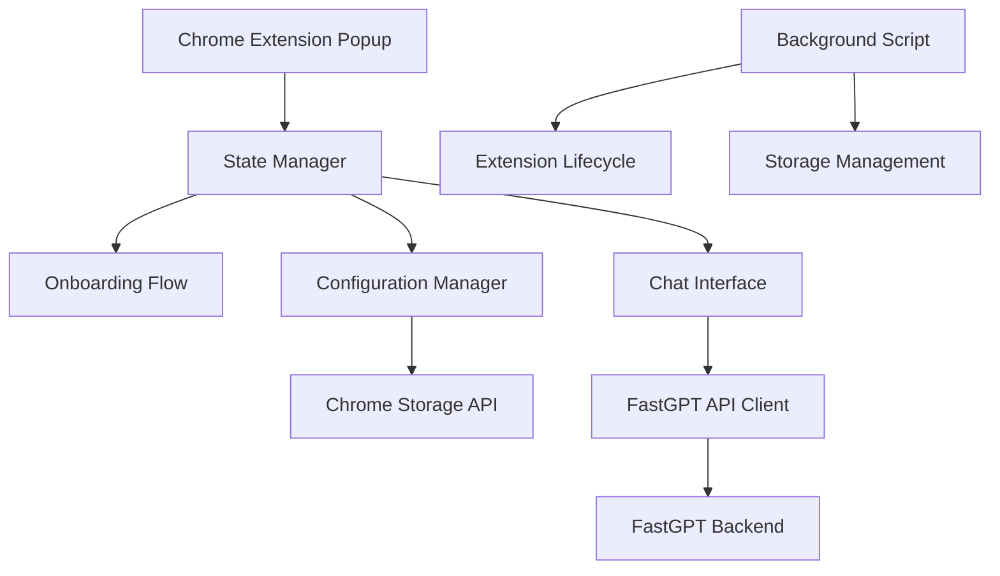

# Design Document

## Overview

The FastGPT Chrome Extension is a browser extension that provides users with seamless access to their FastGPT knowledge base directly from their browser. The extension features a comprehensive onboarding flow for new users, secure configuration management, and an intuitive chat interface that leverages FastGPT's OpenAI-compatible API.

The extension follows a progressive disclosure approach, guiding users through setup, configuration, and usage phases while maintaining a clean and accessible interface throughout.

## Architecture

### High-Level Architecture



### Extension Structure

The extension follows Chrome Extension Manifest V3 architecture with the following components:

- **Popup Interface**: Main user interface displayed when extension icon is clicked
- **Background Script**: Handles extension lifecycle and storage management
- **Content Scripts**: Not required for this implementation
- **Storage Layer**: Utilizes Chrome Storage API for secure data persistence

## Components and Interfaces

### 1. State Management System

**Purpose**: Centralized state management for the extension's different phases

**Key Responsibilities**:
- Track user setup progress (onboarding → configuration → chat)
- Manage application state transitions
- Handle data persistence and retrieval

**Interface**:
```typescript
interface ExtensionState {
  setupComplete: boolean;
  configurationComplete: boolean;
  currentView: 'onboarding' | 'configuration' | 'chat';
  fastgptConfig?: FastGPTConfig;
}

interface FastGPTConfig {
  baseUrl: string;
  appId: string;
  apiKey: string;
}
```

### 2. Onboarding Flow Component

**Purpose**: Guide new users through FastGPT setup process

**Key Features**:
- Step-by-step instructions for FastGPT account creation
- Knowledge base setup guidance
- Simple app creation instructions
- Progress tracking and navigation

**Interface**:
```typescript
interface OnboardingStep {
  id: string;
  title: string;
  description: string;
  actionUrl?: string;
  completed: boolean;
}
```

### 3. Configuration Manager

**Purpose**: Handle FastGPT connection settings and validation

**Key Features**:
- Input validation for URL, App ID, and API Key formats
- Secure storage of configuration data
- Connection testing functionality
- Error handling and user feedback

**Interface**:
```typescript
interface ConfigurationManager {
  validateConfig(config: FastGPTConfig): ValidationResult;
  saveConfig(config: FastGPTConfig): Promise<void>;
  loadConfig(): Promise<FastGPTConfig | null>;
  testConnection(config: FastGPTConfig): Promise<boolean>;
}

interface ValidationResult {
  isValid: boolean;
  errors: string[];
}
```

### 4. Chat Interface Component

**Purpose**: Provide conversational interface with FastGPT knowledge base

**Key Features**:
- Message input and display
- Real-time streaming responses
- Chat history persistence
- Error handling for API failures
- Loading states and indicators

**Interface**:
```typescript
interface ChatMessage {
  id: string;
  role: 'user' | 'assistant';
  content: string;
  timestamp: Date;
}

interface ChatSession {
  id: string;
  messages: ChatMessage[];
  createdAt: Date;
  updatedAt: Date;
}
```

### 5. FastGPT API Client

**Purpose**: Handle communication with FastGPT backend services

**Key Features**:
- OpenAI-compatible API integration
- Support for both streaming and non-streaming responses
- Automatic retry logic for failed requests
- Proper error handling and user feedback

**Interface**:
```typescript
interface FastGPTClient {
  sendMessage(message: string, chatId?: string): Promise<string>;
  sendMessageStream(message: string, chatId?: string): AsyncGenerator<string>;
  validateConnection(): Promise<boolean>;
}
```

## Data Models

### Storage Schema

**Chrome Storage Structure**:
```typescript
interface ExtensionStorage {
  // Configuration data
  fastgptConfig?: {
    baseUrl: string;
    appId: string;
    apiKey: string; // Encrypted
  };
  
  // Setup progress
  setupState: {
    onboardingComplete: boolean;
    configurationComplete: boolean;
  };
  
  // Chat data
  chatSessions: {
    [sessionId: string]: {
      messages: ChatMessage[];
      createdAt: string;
      updatedAt: string;
    };
  };
  
  // User preferences
  preferences: {
    theme?: 'light' | 'dark';
    streamingEnabled: boolean;
  };
}
```

### API Request/Response Models

**Chat Request Model** (based on FastGPT documentation):
```typescript
interface ChatRequest {
  chatId?: string;
  stream: boolean;
  detail: boolean;
  messages: {
    role: 'user' | 'assistant';
    content: string;
  }[];
  variables?: Record<string, any>;
}
```

**Chat Response Model**:
```typescript
interface ChatResponse {
  id: string;
  model: string;
  usage: {
    prompt_tokens: number;
    completion_tokens: number;
    total_tokens: number;
  };
  choices: {
    message: {
      role: 'assistant';
      content: string;
    };
    finish_reason: string;
    index: number;
  }[];
}
```

## Error Handling

### Error Categories

1. **Configuration Errors**:
   - Invalid URL format
   - Missing or invalid API credentials
   - Network connectivity issues

2. **API Errors**:
   - Authentication failures
   - Rate limiting
   - Service unavailability
   - Invalid request format

3. **Storage Errors**:
   - Chrome storage quota exceeded
   - Permission issues
   - Data corruption

### Error Handling Strategy

```typescript
interface ErrorHandler {
  handleConfigurationError(error: ConfigurationError): void;
  handleAPIError(error: APIError): void;
  handleStorageError(error: StorageError): void;
  displayUserFriendlyMessage(error: Error): void;
}
```

## Testing Strategy

### Unit Testing
- Component logic testing using Jest
- API client testing with mocked responses
- Storage manager testing with Chrome API mocks
- Validation logic testing

### Integration Testing
- End-to-end user flows
- API integration testing with FastGPT sandbox
- Chrome extension API integration testing

### Manual Testing
- Cross-browser compatibility (Chrome, Edge, Brave)
- Different screen sizes and resolutions
- Various FastGPT configurations
- Error scenarios and edge cases

## Security Considerations

### Data Protection
- API keys encrypted before storage using Chrome's built-in encryption
- No sensitive data logged to console
- Secure transmission over HTTPS only
- Minimal data retention policy

### Permission Management
- Request only necessary Chrome permissions
- Explicit user consent for data storage
- Clear privacy policy and data usage disclosure

### Input Validation
- Sanitize all user inputs
- Validate API responses before processing
- Prevent XSS attacks through proper content handling

## Performance Considerations

### Optimization Strategies
- Lazy loading of components
- Efficient message batching for API calls
- Debounced input handling
- Optimized storage operations

### Resource Management
- Memory-efficient chat history storage
- Automatic cleanup of old chat sessions
- Efficient DOM manipulation
- Minimal background script resource usage

## User Experience Design

### Interface Flow
1. **First Launch**: Onboarding flow with clear FastGPT setup instructions
2. **Configuration**: Simple form with validation and helpful error messages
3. **Chat Interface**: Clean, familiar chat UI with proper loading states

### Accessibility Features
- Keyboard navigation support
- Screen reader compatibility
- High contrast mode support
- Proper ARIA labels and roles

### Responsive Design
- Adaptive layout for different popup sizes
- Scalable typography and spacing
- Touch-friendly interface elements

## Deployment and Distribution

### Build Process
- Webpack-based build system
- TypeScript compilation
- Asset optimization and minification
- Manifest validation

### Distribution Strategy
- Chrome Web Store publication
- Version management and update strategy
- User feedback collection and monitoring