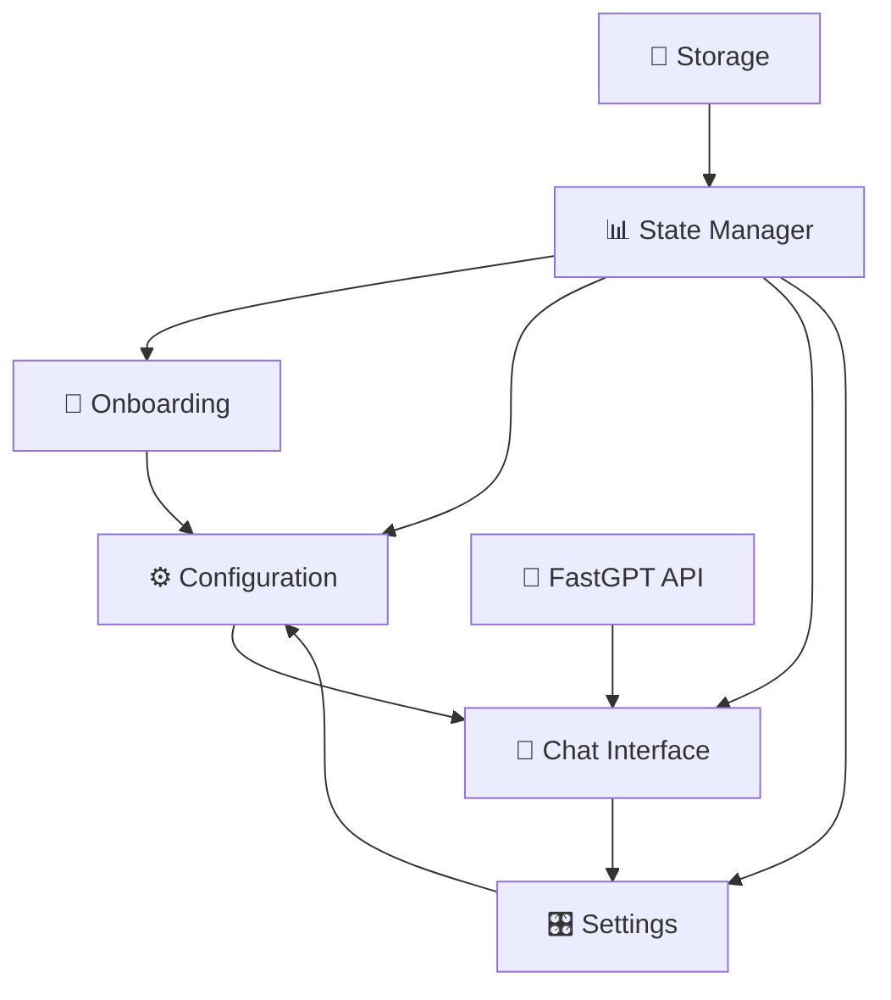

# 🚀 FastGPT Chrome Extension

<div align="center">


**Access your FastGPT knowledge base directly from your browser with this powerful, feature-rich Chrome extension!**

[Features](#-features) • [Installation](#-installation) • [Development](#-development) • [Architecture](#-architecture) • [Contributing](#-contributing)

</div>

---

## ✨ Features

### 🎯 **Core Functionality**

- **🤖 AI-Powered Chat Interface** - Seamless conversations with your FastGPT knowledge base
- **⚡ Real-time Streaming Responses** - Watch AI responses appear in real-time with smooth streaming
- **💾 Persistent Chat History** - Never lose your conversations with automatic session management
- **🔧 Smart Configuration Management** - Easy setup with connection testing and validation

### 🎨 **User Experience**

- **🚀 Progressive Onboarding** - Guided setup process for new users
- **📱 Responsive Design** - Works perfectly across different screen sizes
- **♿ Accessibility First** - Full keyboard navigation and screen reader support
- **🌙 Modern UI/UX** - Clean, intuitive interface with smooth animations

### 🔒 **Security & Privacy**

- **🔐 Encrypted Storage** - API keys and sensitive data are encrypted using Chrome's built-in encryption
- **🛡️ Secure Communication** - All API calls use HTTPS with proper error handling
- **🔑 Local Data Storage** - Your data stays on your device with Chrome's secure storage API

### 🛠️ **Advanced Features**

- **🔄 Dynamic Configuration Reloading** - Update settings without restarting the extension
- **📊 Data Management** - Export/import your chat history and settings
- **🎛️ Comprehensive Settings** - Fine-tune every aspect of your experience
- **🔍 Connection Testing** - Validate your FastGPT configuration before saving

### 💻 **Developer Experience**

- **📦 Modern Build System** - Webpack with TypeScript and hot reloading
- **🧪 Comprehensive Testing** - Unit and integration tests with Jest
- **📋 Type Safety** - Full TypeScript implementation with strict typing
- **🏗️ Modular Architecture** - Clean, maintainable code structure

---

## 🎪 Cool Things About This Project

### 🔥 **Technical Highlights**

#### **🎨 Beautiful Icon System**

- Custom-designed icons with AI-inspired circuit patterns
- Responsive design that looks great at all sizes (16px, 48px, 128px)
- Professional gradient backgrounds with modern aesthetics
- Includes an interactive HTML icon generator tool

#### **🧠 Smart State Management**

```typescript
// Intelligent state transitions between onboarding → configuration → chat
interface ExtensionState {
  setupComplete: boolean;
  configurationComplete: boolean;
  currentView: "onboarding" | "configuration" | "chat" | "settings";
  fastgptConfig?: FastGPTConfig;
}
```

#### **⚡ Real-time Streaming Magic**

```typescript
// Watch AI responses appear character by character
for await (const chunk of this.fastgptClient.sendMessageStream(message)) {
  accumulatedContent += chunk;
  messageElement.innerHTML = this.formatMessageContent(accumulatedContent);
  this.scrollToBottom(); // Smooth auto-scroll
}
```

#### **🔄 Event-Driven Architecture**

```typescript
// Components communicate through custom events
window.dispatchEvent(
  new CustomEvent("configurationUpdated", {
    detail: { config: newConfig, timestamp: new Date() },
  })
);
```

### 🎯 **User-Centric Design**

#### **📱 Progressive Web App Feel**

- Smooth transitions between different views
- Loading states and progress indicators
- Error handling with user-friendly messages
- Responsive layout that adapts to popup size

#### **🎨 Rich Text Formatting**

- Full Markdown support in chat messages
- Syntax highlighting for code blocks
- Clickable links with security measures
- Beautiful typography and spacing

#### **💾 Smart Data Persistence**

```typescript
// Automatic session management
interface ChatSession {
  id: string;
  messages: ChatMessage[];
  createdAt: Date;
  updatedAt: Date;
}
```

---

## 🚀 Installation

### 📦 **For Users**

1. Download the latest release from the [Chrome Web Store](#) (coming soon!)
2. Or load the unpacked extension in developer mode

### 🛠️ **For Developers**

#### **Prerequisites**

- Node.js (v16 or higher)
- npm or yarn
- Chrome browser

#### **Quick Start**

```bash
# Clone the repository
git clone https://github.com/your-username/fastgpt-chrome-extension.git
cd fastgpt-chrome-extension

# Install dependencies
npm install

# Build the extension
npm run build

# For development with hot reload
npm run dev
```

#### **Load in Chrome**

1. Open `chrome://extensions/`
2. Enable "Developer mode"
3. Click "Load unpacked" → select `dist` folder
4. 🎉 Start using your FastGPT extension!

---

## 🏗️ Architecture

### 📁 **Project Structure**

```
fastgpt-chrome-extension/
├── 🎨 src/
│   ├── 🖼️ popup/              # Main UI components
│   │   ├── components/        # Modular UI components
│   │   │   ├── chat.ts       # 💬 Chat interface with streaming
│   │   │   ├── configuration.ts # ⚙️ Settings management
│   │   │   ├── onboarding.ts # 🚀 User onboarding flow
│   │   │   └── settings.ts   # 🎛️ Advanced settings
│   │   ├── popup.html        # 📄 Main popup template
│   │   ├── popup.css         # 🎨 Beautiful styling
│   │   └── popup.ts          # 🧠 Main application logic
│   ├── 🔧 api/               # FastGPT integration
│   │   └── fastgptClient.ts  # 🤖 AI client with streaming
│   ├── 💾 storage/           # Data persistence
│   │   ├── storage.ts        # 🔒 Encrypted storage manager
│   │   └── encryption.ts     # 🛡️ Security utilities
│   ├── 🎯 state/             # State management
│   │   └── stateManager.ts   # 📊 Centralized state control
│   ├── 🏷️ types/             # TypeScript definitions
│   │   └── storage.ts        # 📋 Type definitions
│   ├── 🖼️ assets/            # Visual assets
│   │   ├── icon16.png        # 📱 Toolbar icon
│   │   ├── icon48.png        # 🖥️ Extension page icon
│   │   ├── icon128.png       # 🏪 Store listing icon
│   │   └── icon.svg          # 🎨 Vector source
│   └── 🔄 background/        # Extension lifecycle
│       └── background.ts     # ⚙️ Service worker
├── 🧪 __tests__/             # Test suites
├── 📦 dist/                  # Built extension
├── 🎨 create_icons.html      # Icon generator tool
├── 📋 manifest.json          # Extension manifest
├── ⚙️ webpack.config.js      # Build configuration
└── 📖 README.md              # This awesome file!
```

### 🔄 **Component Flow**



---

## 🛠️ Development

### 📋 **Available Scripts**

```bash
npm run build      # 🏗️ Production build with optimization
npm run dev        # 🔥 Development build with hot reload
npm run test       # 🧪 Run test suites
npm run lint       # 🔍 Code quality checks
npm run clean      # 🧹 Clean build directory
```

### 🧪 **Testing**

```bash
# Run all tests
npm test

# Run tests with coverage
npm run test:coverage

# Run tests in watch mode
npm run test:watch
```

### 🎨 **Icon Generation**

Open `create_icons.html` in your browser to generate beautiful icons:

- 🎯 Interactive preview
- 📱 Multiple sizes (16px, 48px, 128px)
- 🎨 Modern gradient design
- 📥 One-click download

---

## 🔧 Configuration

### ⚙️ **FastGPT Setup**

1. **Base URL**: Your FastGPT instance URL
2. **App ID**: Your application identifier
3. **API Key**: Your authentication key

### 🎛️ **Advanced Settings**

- 💬 Chat history management
- 📊 Data export/import
- 🔒 Security preferences
- 🎨 UI customization

---

## 🤝 Contributing

We love contributions! Here's how you can help:

### 🐛 **Bug Reports**

- Use the issue template
- Include steps to reproduce
- Add screenshots if applicable

### ✨ **Feature Requests**

- Describe the use case
- Explain the expected behavior
- Consider implementation complexity

### 💻 **Code Contributions**

1. Fork the repository
2. Create a feature branch
3. Make your changes
4. Add tests if applicable
5. Submit a pull request

---

## 📄 License

This project is licensed under the MIT License - see the [LICENSE](LICENSE) file for details.

---

## 🙏 Acknowledgments

- 🤖 **FastGPT Team** - For the amazing AI platform
- 🎨 **Design Inspiration** - Modern Chrome extension patterns
- 🛠️ **Open Source Community** - For the tools and libraries

---

<div align="center">

**Made with ❤️ for the FastGPT community**

[⭐ Star this repo](https://github.com/your-username/fastgpt-chrome-extension) • [🐛 Report Bug](https://github.com/your-username/fastgpt-chrome-extension/issues) • [💡 Request Feature](https://github.com/your-username/fastgpt-chrome-extension/issues)

</div>
